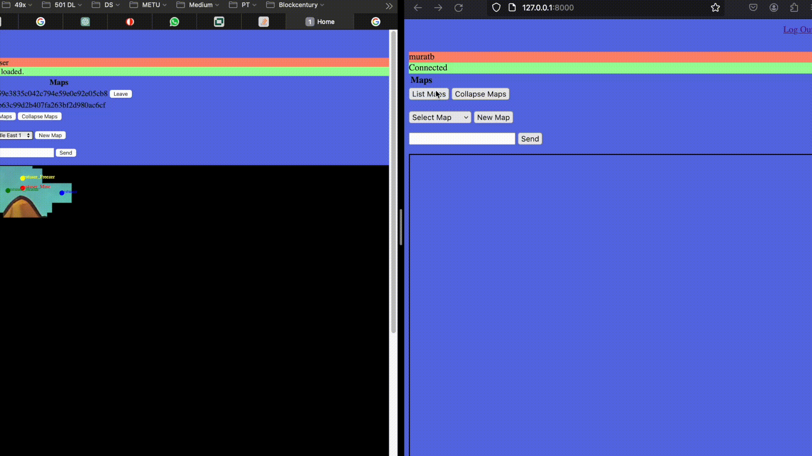

# Multiplayer Online Game Server-Client System



## Overview
Author: Murat Bayraktar  

This project showcases the backend development of a multiplayer online game using Python and Django. The architecture splits into a server component handling game logic and client components interacting with users. The server runs on Python, accepting connections over WebSockets, and the Django-based clients maintain responsiveness and user interaction. This repository serves as a proof of concept for online gaming, focusing on abstracting client inputs, running the game on the server, and broadcasting updates to all clients.

## Features

- **Server-Side Game Logic**: Centralized game processing ensures synchronized state across all clients.
- **Client Responsiveness**: Utilizes Django to create a responsive frontend for player interactions.
- **WebSocket Communication**: Implements real-time bi-directional communication between server and clients.
- **Token-Based Authentication**: Securely identifies and validates users through tokens.
- **Multithreading in Game Objects**: `Freezer` and `Mine` objects operate on separate threads for concurrent actions.

## Installation

To set up the game server and client on your local machine, follow these steps:

1. Clone the repository:

```shell
git clone https://github.com/muratbayrktr/Map-Game-with-Django.git
```

2. Navigate into the project directory:

```shell
cd Map-Game-with-Django
```

3. Install the required dependencies:

```shell
pip install django ... # Other necessary packages, I am too lazy for this
```

4. Start the server by running:

```shell
python wserver.py <ip:port>
```

5. In a new terminal window, start the Django client:

```shell
python manage.py runserver
```

## Usage

After starting both the server and the client, open a web browser and navigate to the client's address to start the game. Log in with your credentials, and you will be connected to the game server automatically.

## Code Snippets

Here are some key snippets from the project:

- **Server Initialization in `wserver.py`**:

```python
# wserver.py snippet
server = WebsocketServer(host, port)
server.set_fn_new_client(new_client)
server.set_fn_client_left(client_left)
server.set_fn_message_received(message_received)
server.run_forever()
```

- **Object Threading in `objects.py`**:

```python
# objects.py snippet
            if type == "Mine":
                if abs(self.position[0] - x) < 10 and abs(self.position[1] - y) < 10:
                    print("mine object found")
                    damage = Catalogue().attach(self.map.getid()).objects[id][4].d
                    proximity = Catalogue().attach(self.map.getid()).objects[id][4].p
                    bomb_x, bomb_y = Catalogue().attach(self.map.getid()).objects[id][2], Catalogue().attach(self.map.getid()).objects[id][3]
                    
                    # Timer thread to wait for 5 seconds
                    if self.activated_bombs.get(id.hex) is None:
                        self.activated_bombs[id.hex] = True
                        timer = Thread(target=self.mine, args=(damage,bomb_x,bomb_y,proximity, id))
                        timer.start()

            if type == "Freezer":
                if abs(self.position[0] - x) < 10 and abs(self.position[1] - y) < 10:
                    print("freezer object found")
                    self.canmove = False
                    seconds_to_wait = Catalogue().attach(self.map.getid()).objects[id][4].d
                    # Create a new timer thread to wait for d seconds
                    timer = Thread(target=self.freeze, args=(seconds_to_wait,))
                    timer.start()
                    Catalogue().attach(self.map.getid()).removeObject(id)
                    Catalogue().attach(self.map.getid()).teammap(self.team.name).team_vision.pop(is_valid_uuid(id))

```

- **WebSocket Communication in `websocket.js`**:

```javascript
// websocket.js snippet
socket.onmessage = function(event) {
    var msg = JSON.parse(event.data);
    // Handle incoming messages
};
```

## Contributing

Contributions to the project are welcome. Please fork the repository and submit a pull request with your changes or suggestions.

## License

This project is licensed under the MIT License - see the LICENSE.md file for details.


